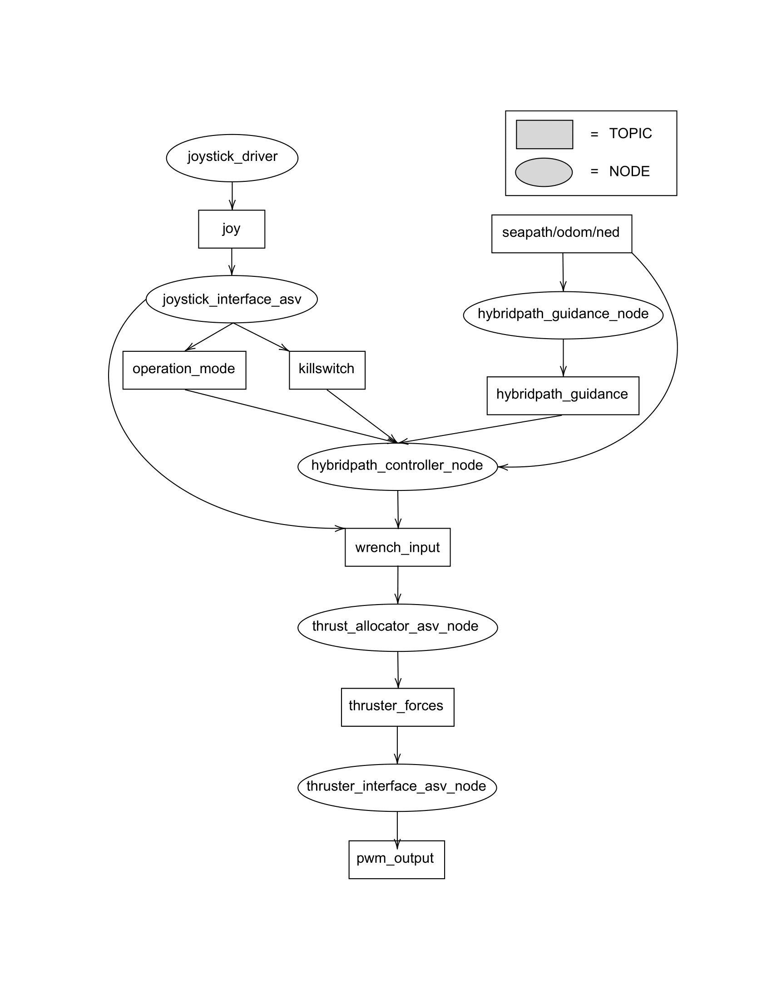

# Vortex-ASV
[](https://github.com/vortexntnu/vortex-asv/actions/workflows/industrial-ci.yml)
[](https://github.com/vortexntnu/vortex-asv/actions/workflows/simulator-test.yml)
[](https://results.pre-commit.ci/latest/github/vortexntnu/vortex-asv/main)
[](https://codecov.io/github/vortexntnu/vortex-asv)

Vortex ASV software. Purpose built for competing in ASV competitions.

## System Overview

The following diagram illustrates the structure of the main nodes in the project:



## Docker
### Prerequisites
- Install [Docker](https://www.docker.com/get-started)
### Building and Running
To build the Docker image (tagged as asv-image:latest) and start a container, execute the following script in this repository:
```bash
./entrypoint.sh
```
Once the container is running, your local workspace is mounted at /ros_ws within the container. This means any changes you make locally are immediately reflected inside the container. Also, if you build inside the container (colcon build), the generated build/, log/, and install/ directories will be stored locally. Your local workspace should follow a standard ROS 2 structure:
```
ros_ws/
│── build/
│── log/
│── install/
│── src/
│   └── vortex-asv/
│   └── vortex-msgs/
```

## Additional Repositories
This project requires additional repositories, which are listed in the [dependencies.repos](dependencies.repos) file, add these to your workspace.
