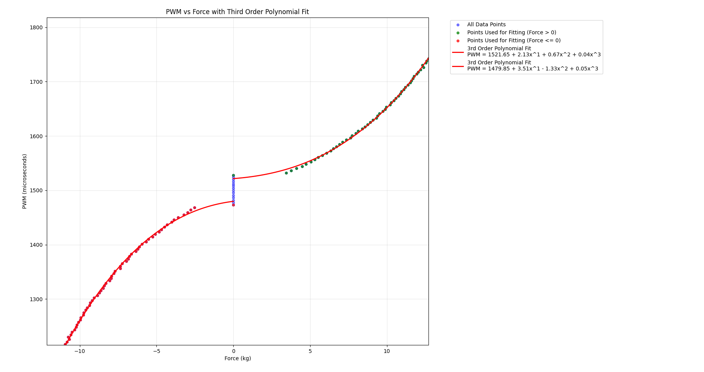

# Thruster Interface ASV

This package provides an interface for controlling the thrusters of freya converting forces values to pwm values. Similarly as what done with orca (see https://github.com/vortexntnu/vortex-auv/tree/main/motion/thruster_interface_auv) the mapping is based on a piecewise third order polynomial approximating the datasheet .csv table found in /resources. Values send via i2c protocol.



*NOTE: No possibility to extend the handling based on the current operating voltage exists for now, as the table is provided only for ??? voltage.*

## Usage

```sh
source install/setup.bash
ros2 launch thruster_interface_asv thruster_interface_asv.launch.py
```

## Structure

### Nodes

1. `thruster_interface_asv_node.cpp` contains the main loop of the node

2. `thruster_interface_asv_ros.cpp` contains the implementation of the node dependent on ros2 creating a subscriber for thruster forces, a publisher for pwm values, and a driver for handling the mapping. Initialize everything extracting all the parameters from .yaml file found in `../asv_setup/config/robots/freya.yaml` and `/config/thruster_interface_asv_config.yaml`.

3. `thruster_interface_asv_driver.cpp` contains the pure .cpp implementation for the mapping, conversion for i2c data format, and sending those values.

### Topics

- *subscribe to:* `/freya/thruster_forces  [vortex_msgs/msg/ThrusterForce]` -- array of forces to apply to each thruster.

- *publish:* `/freya/pwm  [std_msgs/msg/Int16MultiArray]` -- pwm command value to apply that force.

## Config

1. Edit `../asv_setup/config/robots/freya.yaml` for thruster parameters like mapping, direction, pwm_min and max.
2. Edit `/config/thruster_interface_asv_config.yaml` for i2c bus and address, and polynomial coefficients for the mapping.

## Contact

For questions or support, please contact [albertomorselli00@gmail.com](mailto:albertomorselli00@gmail.com).